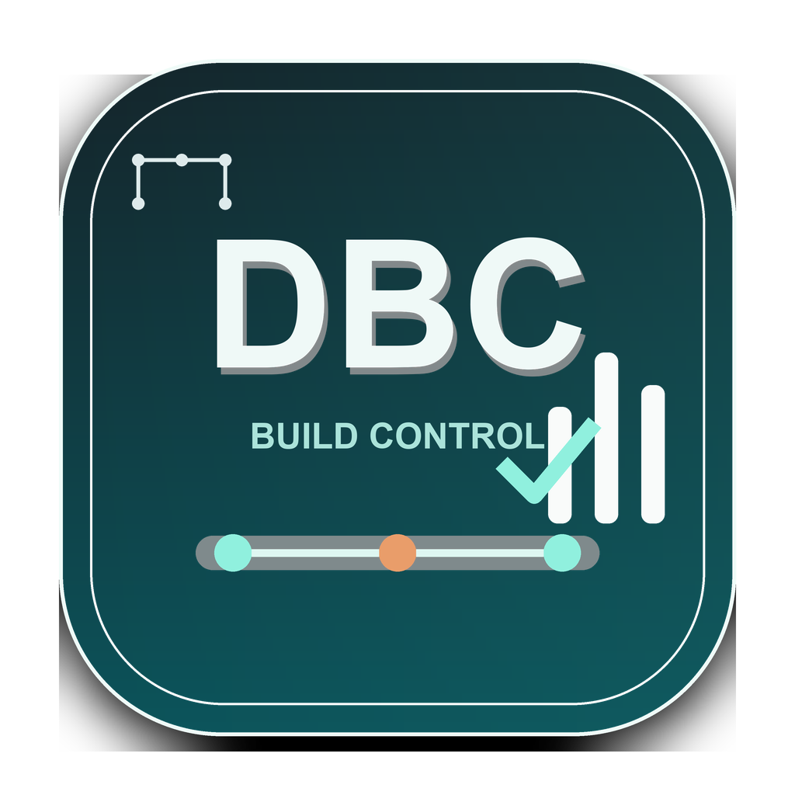
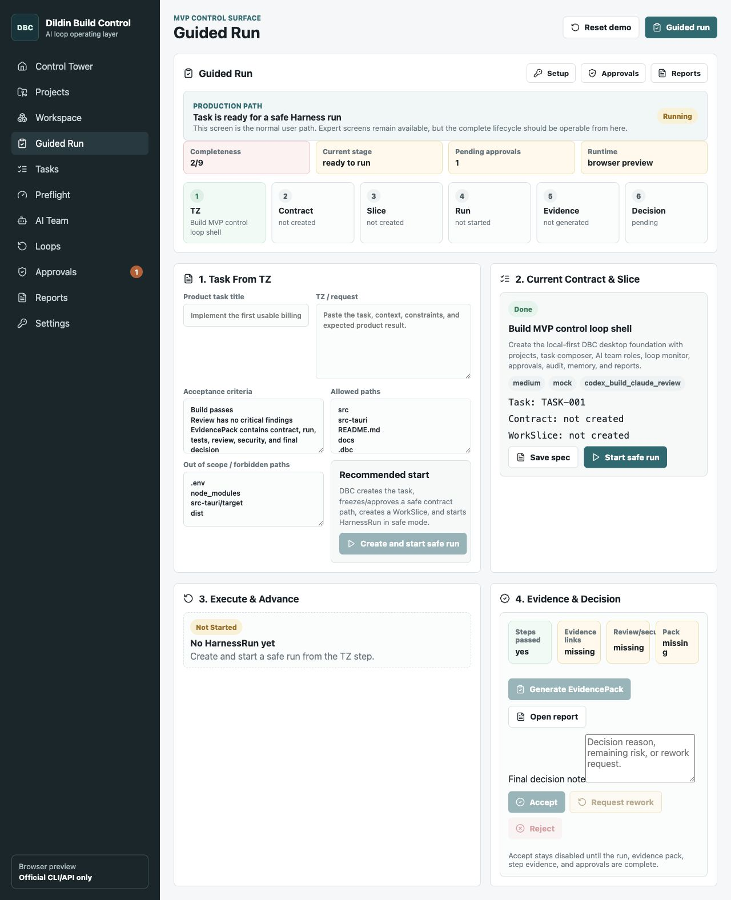
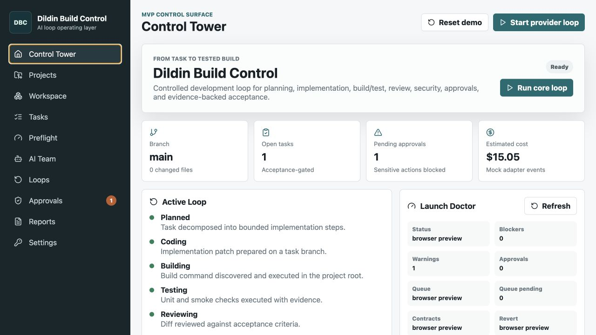
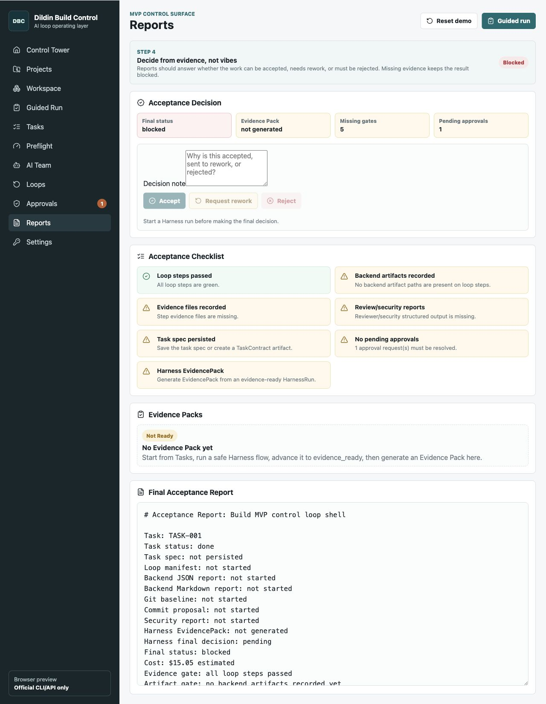

# Dildin Build Control

<p align="center">
  
</p>

<p align="center">
  <strong>A local-first control tower for auditable AI coding loops.</strong>
</p>

<p align="center">
  <a href="https://github.com/vistadi/dildin-build-control/actions/workflows/ci.yml"></a>
  <a href="https://github.com/vistadi/dildin-build-control/actions/workflows/codeql.yml"></a>
  <a href="https://github.com/vistadi/dildin-build-control/releases"></a>
  <a href="LICENSE"></a>
  
  
</p>

DBC turns AI-assisted software work into a controlled production loop: define scope, route local CLI agents, run preflight gates, collect build and review evidence, and make a human acceptance decision. It is built for teams that want agent speed without giving up command policy, approvals, traceability, or rollback.

> [!IMPORTANT]
> DBC is alpha software. Use mock or controlled-smoke mode first. Published macOS builds are currently unsigned and may trigger a Gatekeeper warning.

## See It Work



Guided Run takes an operator from a pasted request to a bounded TaskContract, HarnessRun, EvidencePack, and final **Accept / Rework / Reject** decision.

| Control Tower | Evidence-backed Reports |
| --- | --- |
|  |  |

[View the complete demo gallery](docs/demo/README.md)

## Why DBC

- **Evidence over transcripts.** Every run produces structured artifacts, checks, reports, and a final verdict.
- **Explicit human control.** DBC never branches, stages, commits, pushes, deploys, resets, or runs destructive commands automatically.
- **Bounded execution.** Task contracts define allowed paths, denied paths, acceptance criteria, budgets, and stop conditions.
- **Provider-agnostic routing.** Use Mock, Codex CLI, Claude Code CLI, Generic CLI, or local terminal runners by role.
- **Local-first project memory.** Portable `.dbc` contracts keep policy, tasks, approvals, loop manifests, evidence, and reports with the project.
- **Security gates.** Secret-like prompt content blocks real provider sends, persisted output is redacted, and sensitive actions require approval.

## Production Loop

```text
Request / TZ
    -> TaskContract
    -> WorkSlice
    -> Preflight
    -> HarnessRun
    -> Build / Test / Review / Security evidence
    -> EvidencePack
    -> Accept / Rework / Reject
    -> Manual git handoff
```

## Try It

### Requirements

- Node.js 24+
- pnpm 11.7+
- Rust stable and the [Tauri 2 prerequisites](https://v2.tauri.app/start/prerequisites/)
- macOS for the current packaged alpha build

### Desktop app

```bash
git clone https://github.com/vistadi/dildin-build-control.git
cd dildin-build-control
pnpm install
pnpm tauri dev
```

### Safe smoke run

Keep all providers in mock mode, then run:

```bash
pnpm controlled-smoke
pnpm evidence-summary -- --latest
```

For frontend-only exploration, use `pnpm dev`. To build a native package locally, use `pnpm tauri build`.

## Download

Pre-release macOS packages are published under [GitHub Releases](https://github.com/vistadi/dildin-build-control/releases). Builds are currently unsigned; review the release notes and checksums before running them.

## What Is Included

- Control Tower and Guided Run operator workflows
- Task Composer with checksum-backed task contracts
- Provider Manager and role-based CLI routing
- Loop preflight, retries, recovery, and approval queue
- Scope, budget, command-policy, and secret-detection gates
- Evidence Dashboard and generated acceptance reports
- Portable `.dbc` workspace contracts and project memory
- Release package, support bundle, and system-audit tooling

## Documentation

- [Architecture](docs/ARCHITECTURE.md)
- [Loop Engineering Manifesto](docs/LOOP_ENGINEERING_MANIFESTO.md)
- [Roadmap](docs/ROADMAP.md)
- [Russian User Guide](docs/DBC_USER_GUIDE_RU.md)
- [Example `.dbc` workspace](examples/dbc-workspace/.dbc/README.md)
- [Demo project](examples/demo-project/README.md)
- [CLI profile example](docs/cli-profiles.example.yaml)
- [Design and usability audit](docs/design-audit/audit.md)

The longer Russian production and testing guides are available under [`docs/`](docs/).

## Verify

```bash
pnpm build
pnpm guided-run-smoke
cargo test --manifest-path src-tauri/Cargo.toml
```

The same checks run in GitHub Actions. Real provider calls are not required for the test suite.

## Project Status

DBC is an early public alpha. The current focus is a stable Guided Run, stronger automated coverage for gates and evidence, portable `.dbc` validation, and signed macOS distribution. See the [roadmap](docs/ROADMAP.md) and [changelog](CHANGELOG.md).

## Contributing

Small, well-scoped contributions are welcome. Start with the open [`good first issue`](https://github.com/vistadi/dildin-build-control/issues?q=is%3Aissue%20state%3Aopen%20label%3A%22good%20first%20issue%22) tasks and read [CONTRIBUTING.md](CONTRIBUTING.md).

Please preserve DBC's central safety boundary: model and local runner output may propose changes, but sensitive commands and final acceptance remain human-controlled.

## License

Licensed under the [Apache License 2.0](LICENSE).
