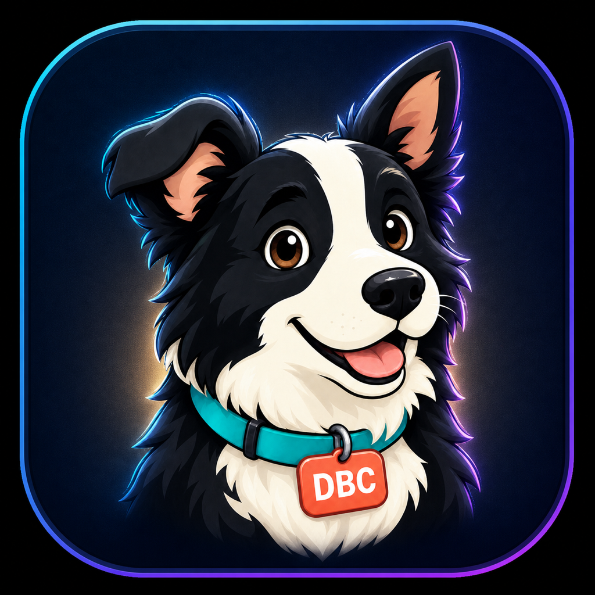
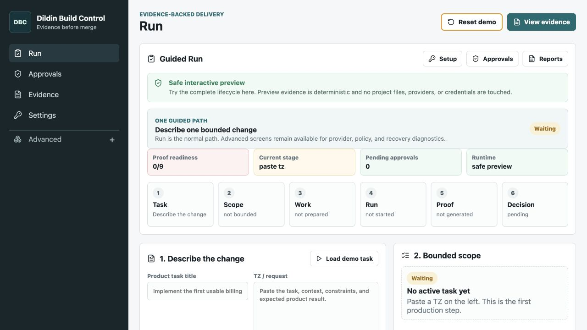
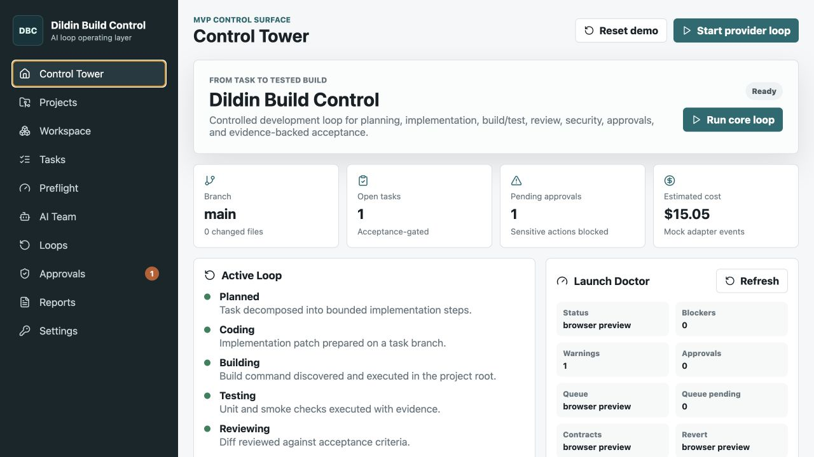
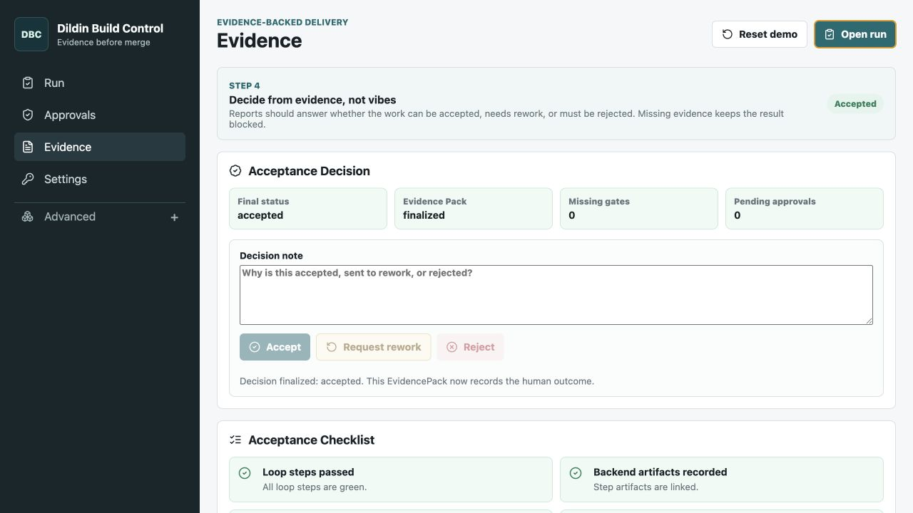

# Dildin Build Control

<p align="center">
  
</p>

<p align="center">
  <strong>Evidence before merge.</strong>
</p>

<p align="center">
  <a href="https://github.com/vistadi/dildin-build-control/actions/workflows/ci.yml"></a>
  <a href="https://github.com/vistadi/dildin-build-control/actions/workflows/codeql.yml"></a>
  <a href="https://github.com/vistadi/dildin-build-control/releases"></a>
  <a href="LICENSE"></a>
  
  
</p>

DBC proves what an AI coding agent changed, checked, and was allowed to do before a human accepts the result. It creates a portable EvidencePack with approved scope, build/test evidence, review and security verdicts, unresolved risks, and the final decision.

Use DBC when Codex CLI, Claude Code, or another local agent can implement the change, but your team still needs one provider-neutral acceptance record.

> [!IMPORTANT]
> DBC is alpha software. Use mock or controlled-smoke mode first. Published macOS builds are currently unsigned and may trigger a Gatekeeper warning.

## See It Work



The primary Run screen takes an operator from one bounded request to a verified EvidencePack and final **Accept / Rework / Reject** decision. The browser preview is interactive and deterministic: it touches no project files, providers, or credentials.

| Control Tower | Evidence-backed Reports |
| --- | --- |
|  |  |

[View the complete demo gallery](docs/demo/README.md)

## Why DBC

- **Proof over “done.”** Every run produces structured artifacts, checks, reports, and a final verdict.
- **Explicit human control.** DBC never branches, stages, commits, pushes, deploys, resets, or runs destructive commands automatically.
- **Bounded execution.** Task contracts define allowed paths, denied paths, acceptance criteria, budgets, and stop conditions.
- **Provider-agnostic routing.** Use Mock, Codex CLI, Claude Code CLI, Generic CLI, or local terminal runners by role.
- **Local-first project memory.** Portable `.dbc` contracts keep policy, tasks, approvals, loop manifests, evidence, and reports with the project.
- **Security gates.** Secret-like prompt content blocks real provider sends, persisted output is redacted, and sensitive actions require approval.

## What DBC Adds

Agent tools already provide their own sandbox, permission, and hook controls. DBC does not replace those controls; it joins their output into a portable acceptance layer.

| Agent/runtime control | DBC acceptance layer |
| --- | --- |
| Limits what one agent may execute | Defines approved task and file scope across providers |
| Prompts for a sensitive tool call | Records the human decision and linked evidence |
| Runs provider-specific hooks | Normalizes build, test, review, and security results |
| Keeps a session transcript | Produces a reviewable EvidencePack |
| Reports that the task is done | Blocks acceptance until required proof exists |

## What an EvidencePack Proves

- the task and allowed/forbidden paths reviewed by the operator;
- the build and test checks that actually ran;
- linked artifacts and machine-readable evidence;
- review and security verdicts;
- pending approvals and unresolved risks;
- the final human Accept, Rework, or Reject decision.

## Production Loop

```text
Request / TZ
    -> TaskContract
    -> WorkSlice
    -> Preflight
    -> HarnessRun
    -> Build / Test / Review / Security evidence
    -> EvidencePack
    -> Accept / Rework / Reject
    -> Manual git handoff
```

## Try It

### Requirements

- Node.js 24+
- pnpm 11.7+
- Rust stable and the [Tauri 2 prerequisites](https://v2.tauri.app/start/prerequisites/)
- macOS for the current packaged alpha build

### Interactive safe preview

No Rust toolchain, provider login, or credentials are required:

```bash
git clone https://github.com/vistadi/dildin-build-control.git
cd dildin-build-control
pnpm install
pnpm dev
```

Open the app, click **Load demo task**, then **Create and start safe run**. Advance the deterministic checks, generate the proof package, and make the final decision.

### Desktop app

```bash
pnpm tauri dev
```

### Safe smoke run

Keep all providers in mock mode, then run:

```bash
pnpm controlled-smoke
pnpm evidence-summary -- --latest
```

For frontend-only exploration, use `pnpm dev`. To build a native package locally, use `pnpm tauri build`.

## Download

Pre-release macOS packages are published under [GitHub Releases](https://github.com/vistadi/dildin-build-control/releases). Builds remain unsigned until the repository signing secrets described in [the release signing guide](docs/RELEASE_SIGNING.md) are configured. Review the release notes and checksums before running any unsigned alpha package.

## What Is Included

- Control Tower and Guided Run operator workflows
- Task Composer with checksum-backed task contracts
- Provider Manager and role-based CLI routing
- Loop preflight, retries, recovery, and approval queue
- Scope, budget, command-policy, and secret-detection gates
- Evidence Dashboard and generated acceptance reports
- Portable `.dbc` workspace contracts and project memory
- Release package, support bundle, and system-audit tooling

## Documentation

- [Architecture](docs/ARCHITECTURE.md)
- [Loop Engineering Manifesto](docs/LOOP_ENGINEERING_MANIFESTO.md)
- [Roadmap](docs/ROADMAP.md)
- [Positioning and target users](docs/POSITIONING.md)
- [30-day go-to-market plan](docs/GTM_30_DAY_PLAN.md)
- [90-second demo script](docs/DEMO_SCRIPT.md)
- [macOS signing and notarization](docs/RELEASE_SIGNING.md)
- [macOS installation guide](docs/INSTALL.md)
- [Russian User Guide](docs/DBC_USER_GUIDE_RU.md)
- [Example `.dbc` workspace](examples/dbc-workspace/.dbc/README.md)
- [Demo project](examples/demo-project/README.md)
- [CLI profile example](docs/cli-profiles.example.yaml)
- [Design and usability audit](docs/design-audit/audit.md)

The longer Russian production and testing guides are available under [`docs/`](docs/).

## Verify

```bash
pnpm build
pnpm guided-run-smoke
pnpm controlled-smoke
pnpm dbc:verify -- --latest
cargo test --manifest-path src-tauri/Cargo.toml
```

`dbc:verify` exits non-zero when required artifacts are missing, approvals remain pending, scope does not pass, or no step evidence exists. The same checks run in GitHub Actions. Real provider calls are not required for the test suite.

When validating a loop while intentionally developing DBC in an already-dirty worktree, use
`pnpm dbc:verify -- --latest --allow-existing-worktree-changes`. This explicit local-only
waiver applies to the scope gate; CI always runs the strict command above.

## Project Status

DBC is an early public alpha. The primary Run and deterministic browser preview are designed for fast evaluation; real provider execution remains approval-gated. The next release priority is signed/notarized macOS distribution and more provider adapter fixtures. See the [roadmap](docs/ROADMAP.md) and [changelog](CHANGELOG.md).

## Contributing

Small, well-scoped contributions are welcome. Start with the open [`good first issue`](https://github.com/vistadi/dildin-build-control/issues?q=is%3Aissue%20state%3Aopen%20label%3A%22good%20first%20issue%22) tasks and read [CONTRIBUTING.md](CONTRIBUTING.md).

Please preserve DBC's central safety boundary: model and local runner output may propose changes, but sensitive commands and final acceptance remain human-controlled.

## License

Licensed under the [Apache License 2.0](LICENSE).
