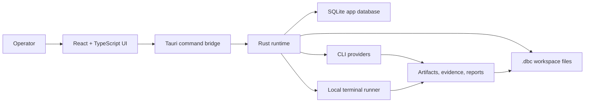
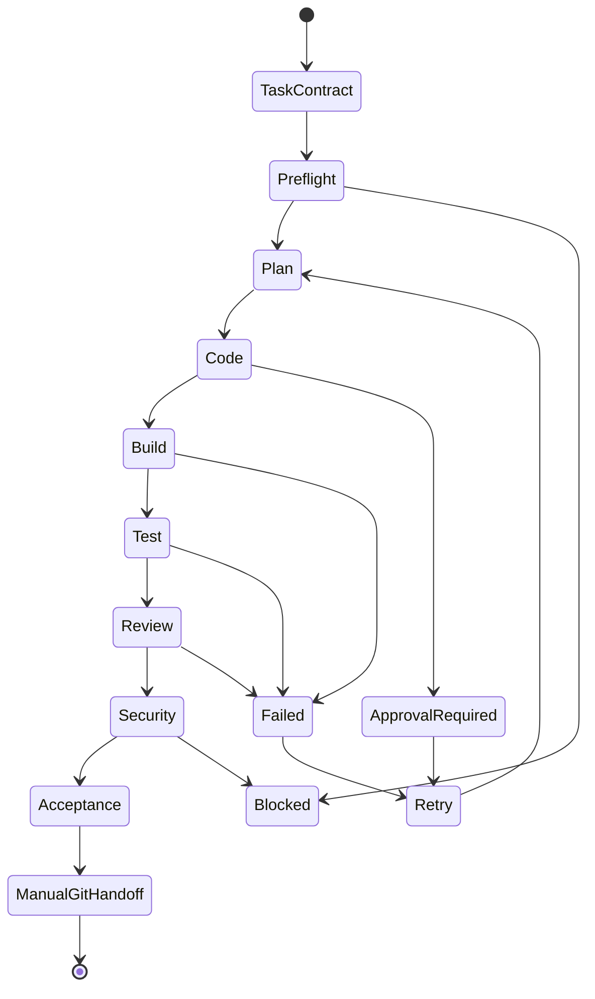

# Architecture

Dildin Build Control is a local-first Tauri desktop app. The frontend gives the operator a control surface; the Rust backend owns command execution, loop persistence, evidence generation, and filesystem access.

## System Shape

## Frontend

- `src/App.tsx` renders the main desktop shell: Control Tower, Projects, Tasks, AI Team, Loop Monitor, Approvals, Reports, and Settings.
- `src/tauriBridge.ts` contains the client contract for native commands and browser fallback behavior.
- `src/cliContracts.ts` mirrors provider argument normalization used by the backend.
- `src/storage.ts` keeps browser-local MVP state for fast iteration when native storage is unavailable.

The UI is intentionally operator-facing. It surfaces gates, approvals, provider diagnostics, evidence, and recovery paths rather than hiding them behind a single "run agent" button.

## Backend

- `src-tauri/src/main.rs` implements Tauri commands, provider execution, command policy checks, loop state, evidence writing, release package generation, and project recovery.
- `src-tauri/src/harness.rs` contains a durable loop harness model for task contracts, slices, runs, evidence packs, and final decisions.
- `src-tauri/Cargo.toml` defines the Rust runtime dependencies. SQLite is bundled through `rusqlite`.

The backend is the authority for any operation that touches the local filesystem, shell, provider commands, release package, or loop manifest.

## Workspace Contract

DBC uses `.dbc/` as the portable project workspace. Important paths include:

- `.dbc/providers.yaml` for provider profiles and role routing.
- `.dbc/policy.yaml` for command policy, approvals, denied commands, and redaction.
- `.dbc/tasks/` for task contracts.
- `.dbc/memory/` for project notes injected into loop prompts.
- `.dbc/loops/` for portable run manifests.
- `.dbc/artifacts/`, `.dbc/evidence/`, `.dbc/reports/`, `.dbc/security/`, and `.dbc/git/` for audit output.

Generated `.dbc` runtime data is ignored in this repository. A safe example workspace lives in `examples/dbc-workspace/.dbc/`.

## Loop Lifecycle

Each step writes machine-readable evidence. A run is not accepted only because a provider says it is done; it must pass scope, build/test, review, security, approval, and evidence gates.

## Provider Model

Providers are assigned by role:

- Team Lead and Product Owner can plan and accept.
- Developer can write workspace changes.
- QA, Reviewer, and Security can inspect output and evidence.
- Local Terminal runs allow-listed build/test commands.

Provider routing is configurable and can use mock mode, Codex CLI, Claude Code CLI, a generic CLI adapter, or local terminal commands. Real provider mode is approval-gated and budget-guarded.

## Git Safety Boundary

DBC records git status, diffs, baselines, and commit proposals, but it does not run broad git mutations automatically. Branch creation, staging, commit, push, reset, clean, checkout, deploy, and release publication remain manual operator actions.

## Persistence Boundary

SQLite stores app/runtime state for the local desktop experience. `.dbc` files are the portable recovery format. If SQLite state is unavailable, DBC can recover tasks, providers, memory notes, loop manifests, evidence, and reports from `.dbc`.
