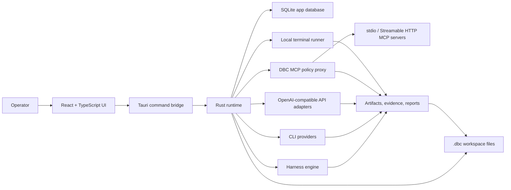
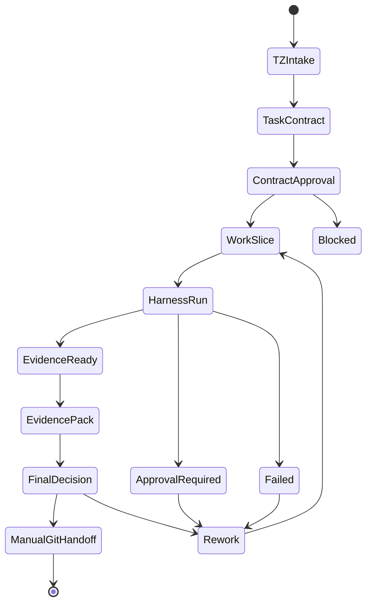
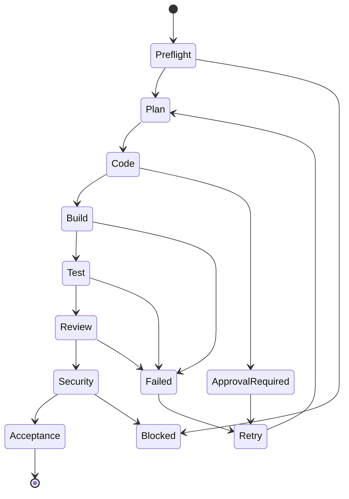

# Architecture

Dildin Build Control is a local-first Tauri desktop app. The frontend gives the operator a guided production flow and expert diagnostic consoles; the Rust backend owns command execution, loop persistence, harness state, evidence generation, and filesystem access.

## System Shape

```mermaid
flowchart LR
  Operator["Operator"] --> UI["React + TypeScript UI"]
  UI --> Bridge["Tauri command bridge"]
  Bridge --> Runtime["Rust runtime"]
  Runtime --> SQLite["SQLite app database"]
  Runtime --> DBC[".dbc workspace files"]
  Runtime --> Providers["CLI providers"]
  Runtime --> API["OpenAI-compatible API adapters"]
  Runtime --> MCP["DBC MCP policy proxy"]
  MCP --> Servers["stdio / Streamable HTTP MCP servers"]
  Runtime --> Shell["Local terminal runner"]
  Runtime --> Harness["Harness engine"]
  Harness --> Evidence
  Providers --> Evidence["Artifacts, evidence, reports"]
  API --> Evidence
  MCP --> Evidence
  Shell --> Evidence
  Evidence --> DBC
```

## Frontend

- `src/App.tsx` renders the main desktop shell: Control Tower, Projects, Workspace, Guided Run, Tasks, AI Team, Loop Monitor, Approvals, Reports, and Settings.
- `src/tauriBridge.ts` contains the client contract for native commands and browser fallback behavior.
- `src/cliContracts.ts` mirrors provider argument normalization used by the backend.
- `src/providerAdapters.ts`, `src/providerStreams.ts`, and `src/apiAdapters.ts` define
  versioned CLI/API contracts and normalized output/usage.
- `src/routing.ts` resolves capability-aware primary/fallback role routes.
- `src/mcp.ts` owns MCP connection validation, tool intent classification, and the
  frontend policy mirror.
- `src/storage.ts` keeps browser-local MVP state for fast iteration when native storage is unavailable.

The UI is intentionally operator-facing. Guided Run is the normal path from TZ intake to final decision. Expert screens still surface gates, approvals, provider diagnostics, evidence, and recovery paths rather than hiding them behind a single "run agent" button.

## Backend

- `src-tauri/src/main.rs` implements Tauri commands, provider execution, command policy checks, loop state, evidence writing, release package generation, and project recovery.
- `src-tauri/src/harness.rs` contains a durable loop harness model for task contracts, slices, runs, evidence packs, and final decisions.
- `src-tauri/Cargo.toml` defines the Rust runtime dependencies. SQLite is bundled through `rusqlite`.

The backend is the authority for any operation that touches the local filesystem, shell, provider commands, release package, or loop manifest.

## Workspace Contract

DBC uses `.dbc/` as the portable project workspace. Important paths include:

- `.dbc/providers.yaml` for provider profiles and role routing.
- `.dbc/policy.yaml` for command policy, approvals, denied commands, and redaction.
- `.dbc/mcp-connections.yaml` and `.dbc/tool-policies.yaml` for portable MCP contracts;
  only OS keychain references may appear, never credential contents.
- `.dbc/model-catalog.yaml` for source-backed model metadata.
- `.dbc/tasks/` for task contracts.
- `.dbc/memory/` for project notes injected into loop prompts.
- `.dbc/loops/` for portable run manifests.
- `.dbc/artifacts/`, `.dbc/evidence/`, `.dbc/reports/`, `.dbc/security/`, and `.dbc/git/` for audit output.
- Harness artifacts link TaskContract, WorkSlice, HarnessRun, EvidencePack, and final decision records.
- `.dbc/evidence/mcp/*.jsonl` records redacted tool decisions/outcomes and
  `.dbc/evidence/<run>/routing-fallback.json` records routing/fallback decisions.

Generated `.dbc` runtime data is ignored in this repository. A safe example workspace lives in `examples/dbc-workspace/.dbc/`.

## Guided Harness Lifecycle

```mermaid
stateDiagram-v2
  [*] --> TZIntake
  TZIntake --> TaskContract
  TaskContract --> ContractApproval
  ContractApproval --> WorkSlice
  WorkSlice --> HarnessRun
  HarnessRun --> EvidenceReady
  EvidenceReady --> EvidencePack
  EvidencePack --> FinalDecision
  FinalDecision --> ManualGitHandoff
  ManualGitHandoff --> [*]

  ContractApproval --> Blocked
  HarnessRun --> ApprovalRequired
  HarnessRun --> Failed
  Failed --> Rework
  ApprovalRequired --> Rework
  FinalDecision --> Rework
  Rework --> WorkSlice
```

Each step writes machine-readable evidence. A run is not accepted only because a provider says it is done; it must pass scope, build/test, review, security, approval, EvidencePack, and final decision gates.

## Expert Loop Lifecycle

The original provider loop remains available for diagnostics and compatibility:

```mermaid
stateDiagram-v2
  [*] --> Preflight
  Preflight --> Plan
  Plan --> Code
  Code --> Build
  Build --> Test
  Test --> Review
  Review --> Security
  Security --> Acceptance
  Acceptance --> [*]

  Preflight --> Blocked
  Code --> ApprovalRequired
  Build --> Failed
  Test --> Failed
  Review --> Failed
  Security --> Blocked
  Failed --> Retry
  ApprovalRequired --> Retry
  Retry --> Plan
```

Guided Run can create and advance a compatibility backend loop so existing loop manifests, reports, and evidence dashboards still work.

## Primary User Flow

1. The operator opens `Guided Run`.
2. The operator pastes a TZ/request, acceptance criteria, allowed paths, and forbidden paths.
3. DBC creates a task, freezes and approves a safe TaskContract path, creates a bounded WorkSlice, and starts a HarnessRun.
4. The operator advances the HarnessRun and generates an EvidencePack.
5. Reports show the Acceptance Checklist and final decision actions.
6. The operator accepts, requests rework, or rejects the result.

## Provider Model

Providers are assigned by role:

- Team Lead and Product Owner can plan and accept.
- Developer can write workspace changes.
- QA, Reviewer, and Security can inspect output and evidence.
- Local Terminal runs allow-listed build/test commands.

Provider routing is configurable and can use mock mode, Codex CLI, Claude Code CLI,
Kimi Code, Qwen Code, a generic CLI adapter, local terminal commands, or disabled
OpenAI-compatible API profiles. Each HarnessRun seals the configured/effective adapter,
model, fallback graph, execution mode, MCP ids, and stable checksum. Real provider mode
is approval-gated and budget-guarded.

## MCP Policy Boundary

Connections start disabled. Stdio discovery performs JSON-RPC initialize and tools/list
without invoking a tool. At execution time the DBC proxy evaluates tool intent,
allow/deny paths, external hosts, argument limits, retries, idempotency, and a run-scoped
approval ledger before forwarding `tools/call`. Raw arguments, secrets, and complete tool
outputs are not persisted in evidence.

## EvidencePack v2

EvidencePack schema v2 verifies required TaskContract, WorkSlice, and HarnessRun
artifacts, seals the execution identity checksum, summarizes MCP and routing activity,
and records provider usage only with an explicit confidence state. Native acceptance
rejects legacy or incomplete verification and still requires exact run/pack identity.

## Git Safety Boundary

DBC records git status, diffs, baselines, and commit proposals, but it does not run broad git mutations automatically. Branch creation, staging, commit, push, reset, clean, checkout, deploy, and release publication remain manual operator actions.

## Persistence Boundary

SQLite stores app/runtime state for the local desktop experience. `.dbc` files are the portable recovery format. If SQLite state is unavailable, DBC can recover tasks, providers, memory notes, loop manifests, evidence, and reports from `.dbc`.
