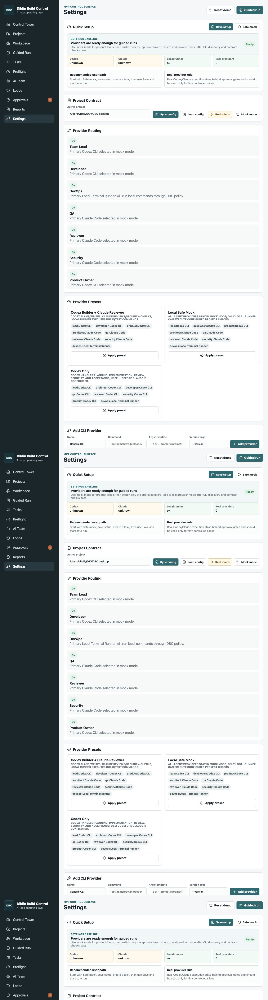

# Demo

The current public demo set uses screenshots committed under `docs/screenshots-guide/`. These are the recommended launch screenshots because they show the newer Guided Run production flow.

## Recommended GitHub Order

1. **Control Tower** - the project-level operator view.
   

2. **Guided Run** - the primary operator path from TZ to safe HarnessRun.
   

3. **Reports Checklist** - acceptance is decided from evidence, not provider claims.
   

4. **Settings Quick Setup** - safe mock setup, provider readiness, and real-provider caution.
   

Older diagnostic screenshots remain under `docs/screenshots/` and deeper design audit captures remain under `docs/design-audit/`.

## GIF Candidates

These flows are good candidates for short launch GIFs:

- Paste TZ in Guided Run, create a safe run, and show the stepper moving from Task to Run.
- Advance HarnessRun to evidence readiness and generate EvidencePack.
- Open Reports, show the Acceptance Checklist, then choose Accept/Rework/Reject.
- Open Settings Quick Setup and show safe mock baseline before real provider mode.

Keep GIFs short and factual. The demo should show gates and evidence, not imply autonomous release or automatic git push.

## Local Demo Verification

Run:

```bash
pnpm build
pnpm guided-run-smoke
```

The guided smoke script checks that the UI strings, production bundle, screenshots, acceptance checklist, quick setup surface, and production guide artifact are present.
