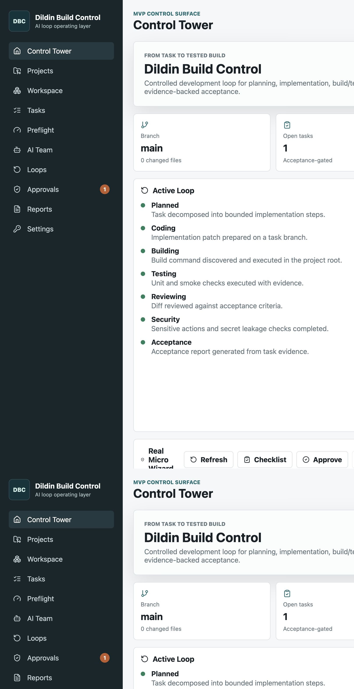
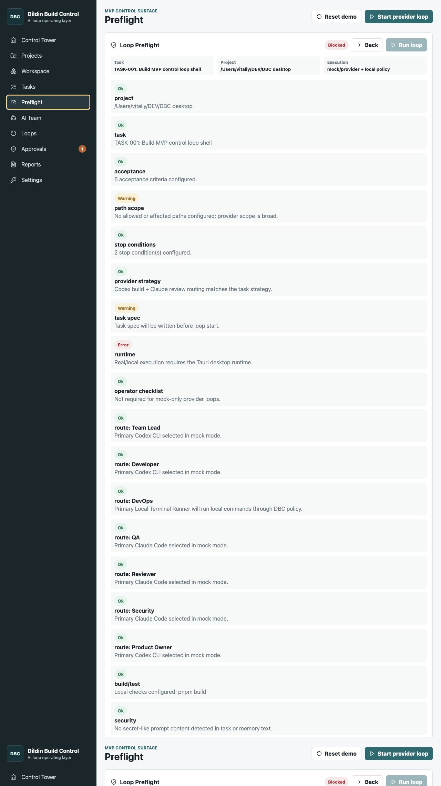
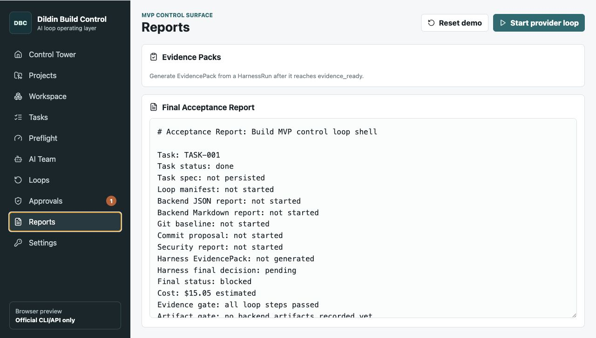

# Demo

The current public demo set uses screenshots that are committed under `docs/screenshots/`.

## Recommended GitHub Order

1. **Control Tower** - the project-level operator view.
   

2. **Preflight Gates** - the run does not start until task, provider, security, build, and git gates are visible.
   

3. **Evidence Reports** - completed runs produce acceptance, evidence, security, and git packages.
   

## GIF Candidates

These flows are good candidates for short launch GIFs:

- Create a task contract and open Loop Preflight.
- Run the controlled smoke loop and watch the Loop Monitor advance.
- Open Loop History and inspect the Evidence Dashboard.

Keep GIFs short and factual. The demo should show gates and evidence, not imply autonomous release or automatic git push.
